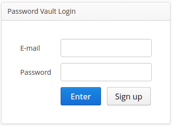
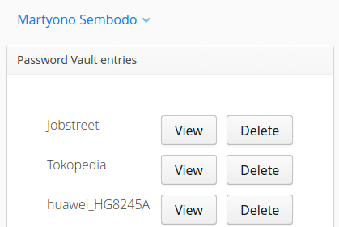

# Password Vault
A multi-user application for storing passwords. Account-password objects are stored in database encrypted with AES. All functions for operation are wrapped in a set of API so that any other client app can utilize the system.

Built-in application is written using Vaadin to demonstrate usage of teh API.

